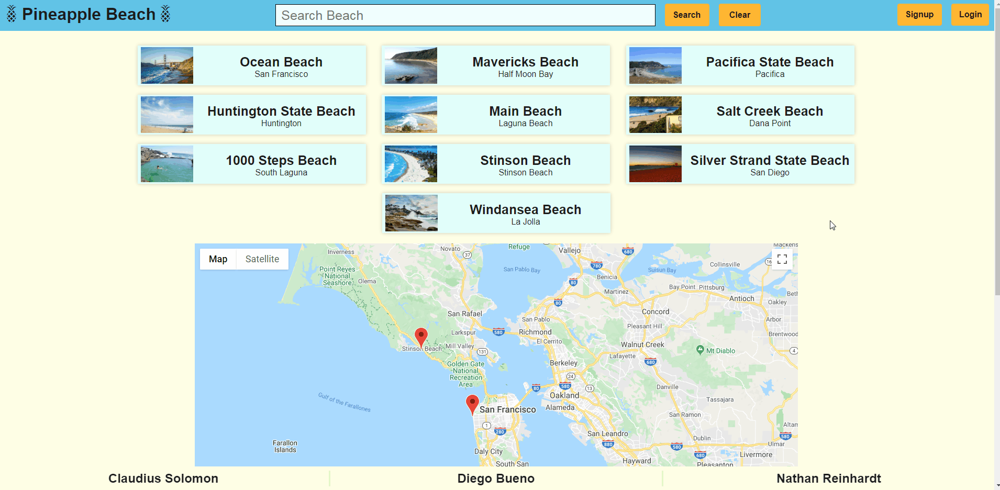

# Pineapple Beaches

[Pineapple Beaches](https://pineapple-beaches.herokuapp.com/) is a website where users can interact with posts and beaches to understand more information about local or travel locations which involve beaches. With real time weather data provided by a third party Web API.



Developed by: [Claudius Solomon](https://github.com/clauddyf), [Diego Bueno](https://github.com/Wolf-Fivousix), [Nathan Reinhardt](https://github.com/Ticonderago)

## Technologies
* JavaScript
* React
* Redux
* Node.js
* Express.js
* MongoDB
* Heroku
* JSON
* SCSS3
* HTML5

## Features
 * Secure backend to frontend with user authentication using BCrypt.
 * Beaches are displayed on the homepage below the search bar.
 * Google Maps Api to see where a beach is located relative to its city with markers on the map.
 * Registered users can review a beach.
 * Real time weather data fetching.
 
 ### User Authentication with BCrypt
 BCrypt is used to make sure that user's password information is secure and is the hardest to reverse the encryption of the passwords. Using this with the login method is really important so user's can have their personal profiles and reviews to keep track of. Profiles can be accessed when you log in and at the top right you click on your name to see your profile. The profile page also shows all of the users reviews that they have posted on beach pages.
 

 
 ```JavaScript
 const newUser = new User({
   username: request.body.username,
   password: request.body.password
 });
 
 bcrypt.genSalt(10, (error, salt) => {
 bcrypt.hash(newUser.password, salt, (error, hashedPassword) => {
     if (error) throw error;
     newUser.password = hashedPassword;
     newUser.save()
         .then(user => {
             const payload = { id: user.id, username: user.username };

             jwt.sign(payload, keys.secretOrKey, { expiresIn: 3600 }, (error, token) => {
               response.json({
                 success: true,
                 token: "Bearer " + token
               });
             });
         })
         .catch(error => console.log(error));
     });
 });
 ```
 
 ### Search Bar & Results
 At the top of the homepage is a search bar to filter out all the available beaches on the website to find what you wanna look for. After finding what you want, click on the beach and you will be taken to the information about the beach with user reviews left in place. Using React framework to build the component out to be used in the Splash Component.
 

 
 ```JavaScript
 import React from "react";

class SearchBar extends React.Component {
    constructor(props) {
        super(props);
        this.state = { search: "" };

        this.handleSubmit = this.handleSubmit.bind(this);
        this.clearButton = this.clearButton.bind(this);
    }

    componentDidMount() {
        this.props.fetchAllBeaches();
    }

    handleChange(field) {
        return (e) => this.setState({ [field]: e.target.value });
    }

    handleSubmit(e) {
        e.preventDefault();
        this.props.fetchBeachByName(this.state.search);
    }

    clearButton() {
        this.props.fetchAllBeaches();
        this.setState({ search: "" });
        document.getElementById("searchBar").value = "";
    }
    
    render() {
        
        return (
            <div className="search-bar-container">
                <form className="search-bar-form">
                    <input
                        id="searchBar"
                        className="searchBarField"
                        type="text"
                        placeholder="Search Beach"
                        onChange={this.handleChange("search")}/>
                    <button
                        className="search-but"
                        onClick={this.handleSubmit}>
                            Search
                    </button>
                    <button
                        type="button"
                        className="clear-but"
                        onClick={this.clearButton}>Clear
                    </button>
                </form>
            </div>
        );
    }
}

export default SearchBar;
 ```
 
 ### Google Maps Api
 Used to keep track of locations of the beaches. When you wanna know where on a coast line a beach is, the google maps api lets you have markers in the specific cities that the beaches are located in.  We use react to map the markers onto the google map.
 

 
 ```JavaScript
    displayMarkers = () => {
        if (this.props.beaches !== undefined) {
            const keys = Object.keys(this.props.beaches);

            return keys.map((key, index) => {
                return <Marker key={index} id={index} position={{
                    lat: this.props.beaches[key].lat,
                    lng: this.props.beaches[key].lon
                }} />
            })
        }
    }

    render() {

        const style = {
            width: '60vw',
            height: '85vh',
            'marginLeft': 'auto',
            'marginRight': 'auto',
            'zIndex': 2
        }

        return (
            <Map
                item
                xs = { 12 }
                style = { style }
                google = { this.props.google }
                onClick = { this.onMapClick }
                zoom = { 10 }
                initialCenter = {
                    {   
                        lat: 37.686703,
                        lng: -122.449174
                    }
                }
            >
                {this.displayMarkers()}
            </Map>
        );
    }
 ```
 
 ### Beach Reviews
 Each Beach Page has user reviews below the information about the beach.  It is anonymous since we don't want bias currently on a small scale for the website.  As we grow the website in the future names will be present for the author of the review. Every beach can have infinite reviews. You have to be logged in to leave a review on a beach by signing up to the website.
 

 
 ```JavaScript
const mongoose = require("mongoose");
const Schema = mongoose.Schema;

const ReviewSchema = new Schema({
   user: {
       type: Schema.Types.ObjectId,
       reference: "users"
   },

   beach: {
       type: Schema.Types.ObjectId,
       references: "beaches"
   },

   post: {
       type: String,
       required: true
   },

   author: {
       type: String,
       references: "users"
   },

   date: {
       type: Date,
       default: Date.now
   }
});

const Review = mongoose.model("review", ReviewSchema);
module.exports = Review;
 ```
 
 ### Web Weather API with CORS protection
 Leveraging [Open Weather](https://openweathermap.org/) API we can provide real time weather data anywhere in the world. In order to balance server load and the most recent data, we concluded that an update every hour sufice the needs for this project. By taking the difference between the last update of our database and the current time we decide if the call should be made. If it happens, we utilize a Promise and local state update to quickly display the updated information.
 

 
 ```JavaScript
 updateWeatherData() {
        // Update if more than 1 hour since last update.
        const timeDifference = (Date.now() - new Date(this.state.date).getTime()) / 1000 / 60;

        if (Math.floor(timeDifference) > 60) {
            const payload = {
                _id: this.state._id,
                lat: this.state.lat,
                lon: this.state.lon
            };
            this.props.updateBeachTemperature(payload)
                .then(newTemp => this.setState({ temperature: newTemp }));
        }
    }
 ```
 
 One of the issues that arise from making API call's to external websites from the client side is the Cross-Origin Resource Sharing (CORS). In order to have that functionality we customized Axios calls in the backend while providing a custom proxy address for Heroku.
```JavaScript
export const updateBeachTemperature = ({ _id, lat, lon }) => (
    axios.get(`https://cors-anywhere.herokuapp.com/http://api.openweathermap.org/data/2.5/weather?lat=${lat}&lon=${lon}&appid=${weatherAPIKey}`)
        .then(weatherData => {
                    axios.patch(`/api/beaches/${_id}`, {
                        temperature: weatherData.data.main.temp,
                        date: new Date()
                    })
                    return weatherData;
                }
));
```
