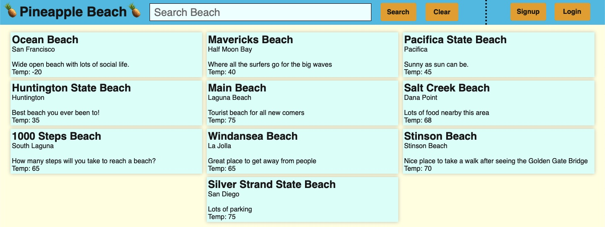
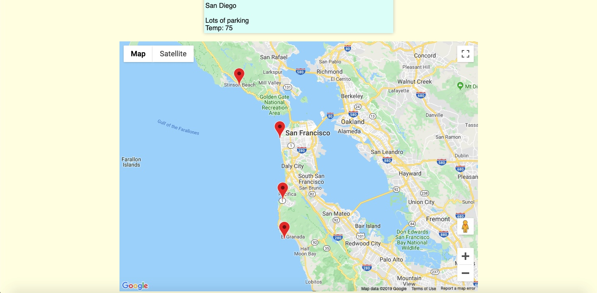
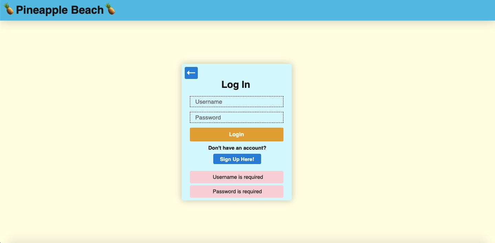

# Pineapple Beaches

[Live App]()

Pineapple Beaches is a website where users can interact with posts and beaches to understand more information about local or travel locations which involve beaches. This project uses MongoDb, Express, React, and Node for the framework.

This project was built and designed within a 5 day period. We do plan on adding more to the project over time.

### Features

 * Secure backend to frontend with user authentication using BCrypt.
 * Any user can only interact with the search bar to find out locations.
 * Beaches are displayed on the homepage and marked on the google map.
 * Google Maps Api to see where a beach is located relative to its city.
 * Weather Api updates the beaches weather once user clicks on a button on the beach page.
 * When a beach is indivdually picked after searching it brings up the beach's individual information.
 * When logged in can leave review/post for a beach.
 
### Screenshots

### Possible Future Features

In the future I would like to add on:

 * Style the individual beach and post/review pages.
 * Ability to have images inside the project.
 * Include likes and follows for beaches.
 * More data for beaches
